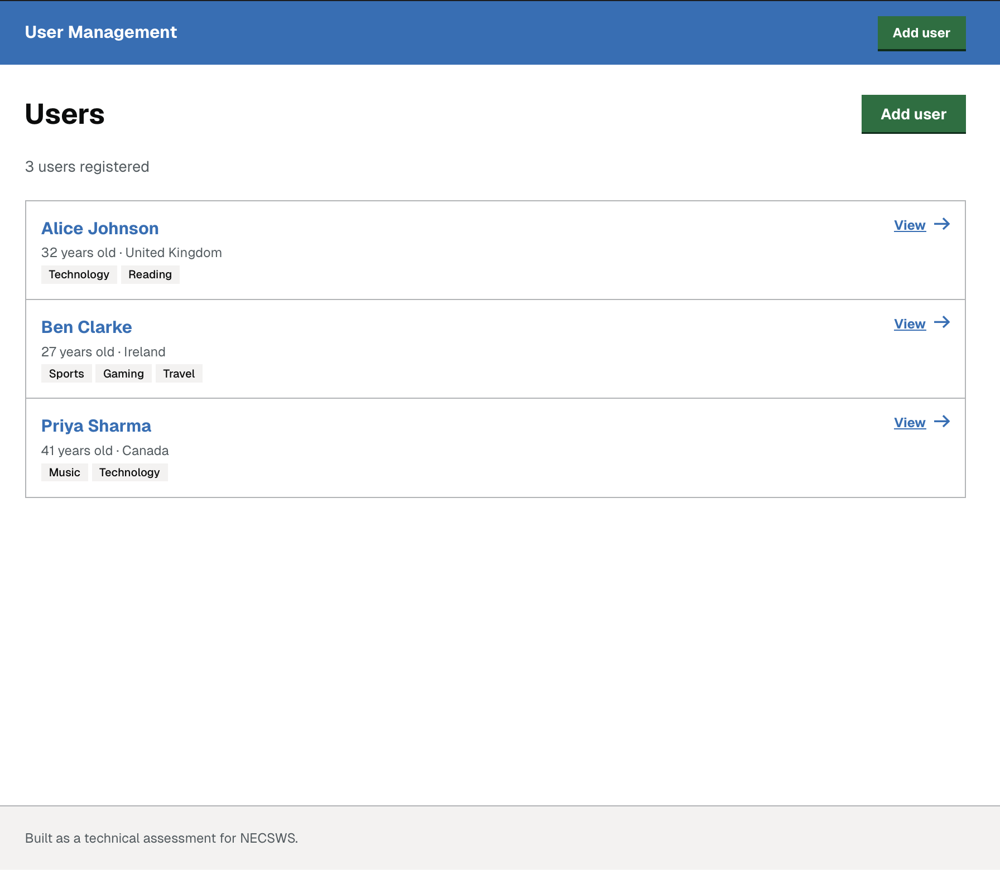
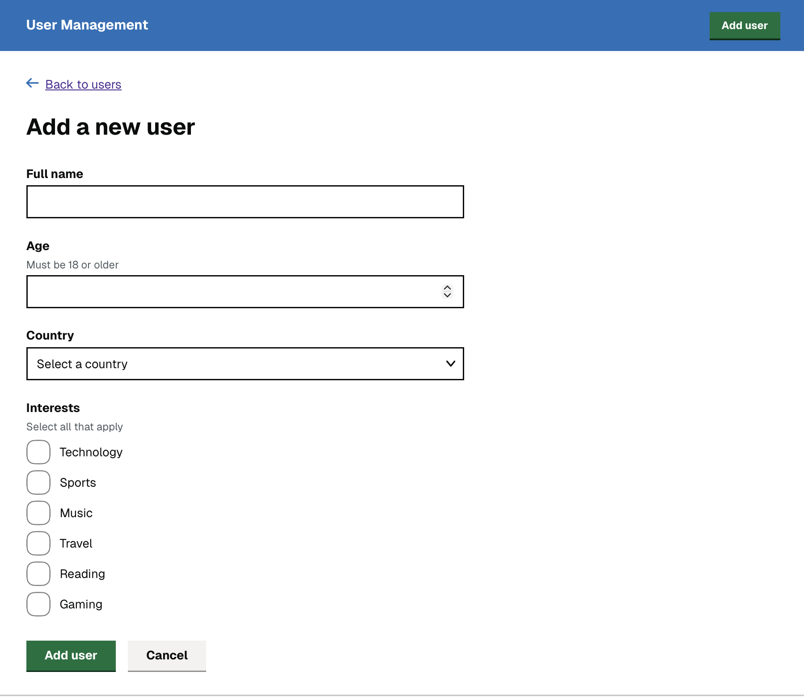
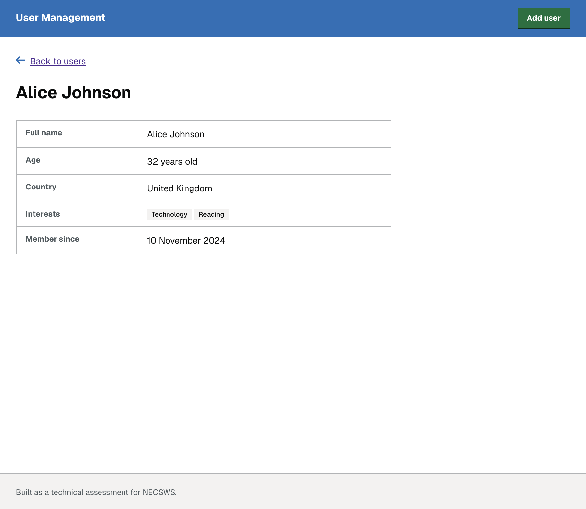

# User Management — NECSWS Technical Assessment

A Next.js 16 + TypeScript app built as a take-home technical assessment. It demonstrates adding, listing, and viewing users with a validated form, accessible UI, a REST-style API route, and a full test suite.

---

## Screenshots

| User list | Add user form | User profile |
|---|---|---|
|  |  |  |

---

## Setup

Requires **Node.js 20+**.

```bash
npm install
npm run dev
```

Open [http://localhost:3000](http://localhost:3000) — it redirects to `/users`.

### Scripts

| Command | Purpose |
|---|---|
| `npm run dev` | Development server (Turbopack) |
| `npm run build` | Production build |
| `npm run test` | Unit + integration tests (Vitest) |
| `npm run lint` | ESLint |
| `npm run format` | Prettier |

---

## Pages

| Route | Description |
|---|---|
| `/users` | List of all users |
| `/users/new` | Form to add a new user |
| `/users/[id]` | Profile page for a selected user |

The root `/` redirects to `/users`.

---

## Form fields and validation

| Field | Rule |
|---|---|
| Full name | Required text, max 100 chars, whitespace trimmed |
| Age | Required integer, must be ≥ 18 and ≤ 120 |
| Country | Required dropdown, must be one of the allowed list |
| Interests | Checkboxes, at least one required |

Validation is handled with **Zod**. The same `UserSchema` is shared on both the client (React Hook Form) and the server API route — single source of truth, no duplication.

---

## Data

All data lives in an in-memory array anchored to `globalThis` (resets on server restart). There is no database. A Next.js Route Handler at `/api/users` handles `GET` and `POST`, keeping the data layer decoupled from the UI and close to how a real API would be structured.

---

## Architecture decisions

### Form management — React Hook Form + Zod

React Hook Form uses **uncontrolled inputs** backed by refs. This avoids re-rendering on every keystroke and eliminates per-field `useState` boilerplate. Zod provides schema-first validation with full TypeScript inference — `UserFormData` is derived directly from `UserSchema` via `z.infer`, so the form data type, validation rules, and API contract are all defined once.

Zod v4 is used (the current major version), which introduced a cleaner error format and better performance over v3.

See [docs/adr/001-form-management.md](docs/adr/001-form-management.md) for the full decision record.

### Folder structure — feature-based

Code is grouped by domain under `src/features/users/` (components, schemas, types) rather than by technical role. This scales better as the feature set grows, since everything for a domain is co-located.

Shared, domain-agnostic primitives (`Input`, `Select`, `Button`, `CheckboxGroup`) live in `src/components/ui/`.

### Server vs Client Components

List and profile pages are Server Components — they fetch data directly and render on the server with no client JS overhead. Only `UserForm` is a Client Component (`'use client'`), keeping the client bundle small.

### Styling — Tailwind CSS v4 + GOV.UK palette

No component library. Tailwind v4 is configured via `globals.css` `@theme` with a GOV.UK-inspired colour palette. The design deliberately follows GOV.UK Design System patterns (error summary, error messages, focus rings) because they are proven, accessible, and familiar to UK public-sector teams.

### Accessibility

- **Error summary** — follows the GOV.UK pattern: a summary block at the top of the form lists all errors with anchor links to the offending fields. It is programmatically focused via the `onError` callback passed as the second argument to `handleSubmit(onSubmit, onError)` — the idiomatic React Hook Form place to run side-effects on validation failure — so keyboard and screen-reader users land directly on the problem list, matching WCAG 2.4 focus management guidance.
- **Field-level errors** — announced with `aria-live="polite"` + `aria-atomic`, linked to inputs via `aria-describedby`, and marked with `aria-invalid`.
- **Skip link** — a visually-hidden "Skip to main content" link satisfies WCAG 2.4.1.
- **Fieldset/legend** — the checkboxes are wrapped in `<fieldset>` + `<legend>` so the group label is read with each checkbox.

### Security headers

`next.config.ts` sets the following HTTP response headers on every route:

- `Content-Security-Policy` — restricts resource origins to `'self'`
- `X-Content-Type-Options: nosniff`
- `X-Frame-Options: DENY`
- `X-XSS-Protection: 1; mode=block`
- `Referrer-Policy: strict-origin-when-cross-origin`
- `Permissions-Policy` — blocks camera, microphone, and geolocation

### Error boundary

`src/app/error.tsx` is a Next.js error boundary for the entire app. If a Server Component throws an uncaught error, users see a friendly message with a "Try again" reset button rather than a blank crash page.

### Loading skeleton

`src/app/users/loading.tsx` is a Next.js Suspense boundary for the `/users` route. It renders an animated skeleton while the Server Component fetches data, preventing layout shift.

---

## Testing

Three test layers:

| Layer | Tool | Coverage |
|---|---|---|
| Schema unit tests | Vitest | All validation rules and edge cases |
| Component unit tests | Vitest + Testing Library | `UserForm` render, validation, submission, error paths |
| API route integration tests | Vitest | `GET` and `POST` handlers, all status codes (200, 201, 400, 422) |

Run tests:

```bash
npm test
```

